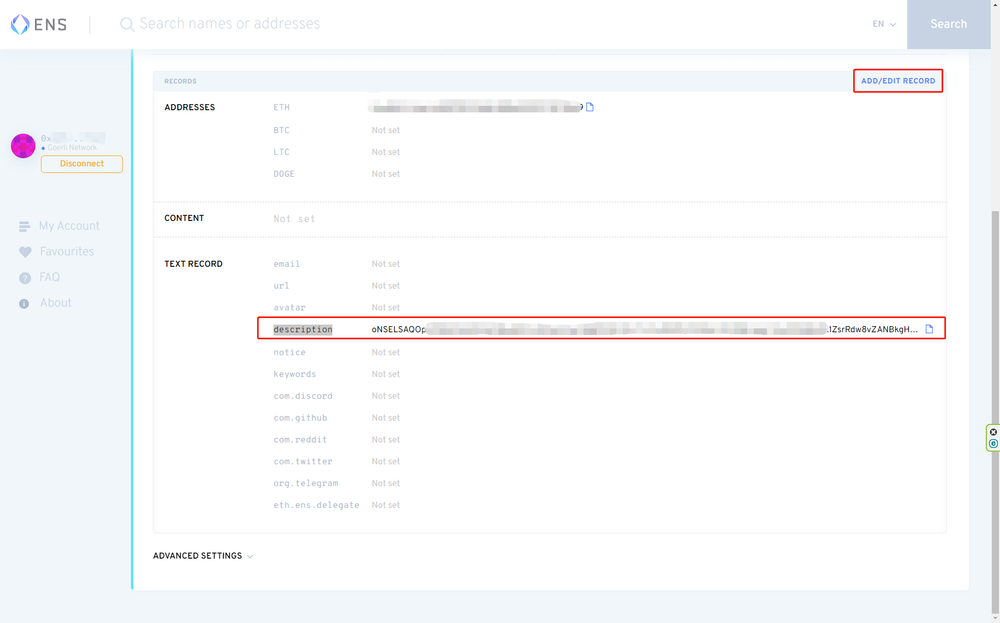

<!--
 * @Author: SpenserCai
 * @Date: 2023-03-06 09:42:26
 * @version: 
 * @LastEditors: SpenserCai
 * @LastEditTime: 2023-03-13 10:16:18
 * @Description: file content
-->
# DRat
[](https://app.fossa.com/projects/git%2Bgithub.com%2FSpenserCai%2FDRat?ref=badge_shield)

去中心化远程控制工具（Decentralized Remote Administration Tool）

## 介绍
DRat是一个去中心化远程控制工具，可以实现在没有服务端和配置文件服务器的情况下实现远程控制和配置下发。

## 支持平台
- Windows
- Linux (其他系统测试通过的可以提交issue)
  - Ubuntu 22.04 ✔

## 特性
### 无需服务端
通过电报实现的远程控制，只需要在Group中发送指令，即可实现远程控制。

### 自带代理
由于电报(Telegram)的特性，需要使用代理才能访问，DRat内置了代理，可以直接使用。

### ENS配置下发
基于去中心化的ENS，可以实现配置文件的下发。

## 功能列表
<!--一个表格来展示:命令 功能 状态-->
| 命令 | 功能 | 状态 |
| :---: | :---: | :---: |
| /help | 帮助 | ✔ |
| /rce start | 开启rce会话 | ✔ |
| /rce stop | 停止rce会话 | ✔ |
| /rce <命令> | 执行命令,如果执行命令前没有开启rce会话则会自动开启 | ✔ |
| /sysinfo | 获取系统信息 | ✔ |
| /restart_drat | 重启drat | ✔ |
| /shutdown_drat | 关闭drat | ✔ |
| /dump_navicat | 导出navicat连接信息 | ✖ |
| /dump_xshell | 导出xshell连接信息 | ✖ |
| /dump_browser | 导出浏览器密码 | ✖ |
| /download <文件路径> | 下载文件 | ✖ |
| /upload <文件路径> | 上传文件 | ✖ |
| /wechat info | 获取微信信息 | ✖ |
| /wechat history | 聊天记录和通讯录 | ✖ |

如果还有别的需求，可以提交issue

## 使用
### 获取
```bash
git clone https://github.com/SpenserCai/DRat.git
```
### ENS域名注册
1. 安装[MetaMask](https://metamask.io/)，并创建账户。
2. 获取测试币，可以通过[Goerli Faucet](https://goerlifaucet.com/)获取。
3. 将MetaMask的网络切换到Goerli 测试网络。
4. 在[ENS](https://app.ens.domains/)中注册域名，请使用8位的域名

### 配置文件
配置文件的格式如下
```json
{
    "TELBOT_TOKEN":"<TOKEN>",
    "TELBOT_CHAT_ID":1234567890,// 电报群ID不要带‘-’
    "CLASH_CONN_STR":"代理类型:地址:端口:加密方式:密码:是否支持udp",// 可以在clash里面找到
    "LOCAL_PROXY_PORT":7890,
    "ENS_DOMAIN":""// 后期这里会支持更新ENS域名，现在不支持
}
```
对于配置文件的上传有两种方案

#### 1. 自动上传配置文件
为了更加方便的完成配置文件的上传，我开发了[DRatConfig工具](https://github.com/SpenserCai/DRatConfig)，可以自行完成加密和上传，前提只需要注册好一个eth域名即可

#### 2. 手动上传配置文件
```bash
python encode_config.py <配置文件路径> <ENS域名(不包含.eth)>
```
生成后会得到一个AES加密好的字符串，将其复制粘贴到ENS域名的description中，可以访问：https://app.ens.domains/name/你的域名/details 编辑。



点击保存，等待一段时间，即可完成配置文件的下发。


### 编译
```bash
# cli 代表调试模式，spy代表后台运行
# windows 
python build.py <ENS配置> cli windows
# linux
python build.py <ENS配置> cli linux
```

配置文件的格式如下
```json
{
    "TELBOT_TOKEN":"",
    "TELBOT_CHAT_ID":0,
    "CLASH_CONN_STR":"",
    "LOCAL_PROXY_PORT":7890,
    "ENS_DOMAIN":"<完整的ENS域名>"
}
```

### 测试
运行程序，在对应的电报群组测试


## 免责声明
本项目仅供学习交流使用，严禁用于非法用途，否则，造成的一切后果由使用者自行承担。 


## License
[](https://app.fossa.com/projects/git%2Bgithub.com%2FSpenserCai%2FDRat?ref=badge_large)